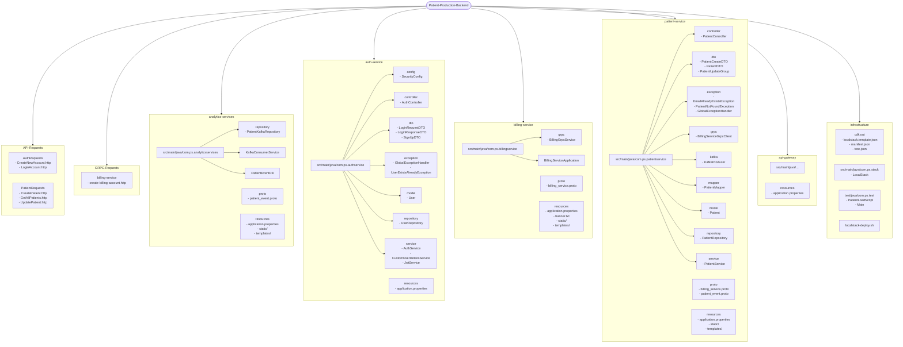
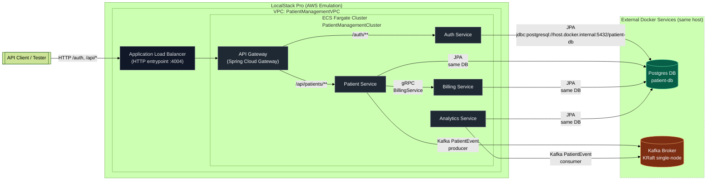

# PulseTrack Patient System

High-performance patient management microservices backend powered by distributed services , real time kafka events,   
gRPC communication, and Production Ready APIs.

# Overview:
This is a microservices-based patient management system designed to perform CRUD Operations on Patient Entity, send account creation notification to billing service, emits Kafka Events to analytics services, with production grade security via spring security and utilizes highly proficient api-gateway for authentication and routes management.
This project not only has development phase completed, but also the deployment phase with it.
It uses AWS CDK library in java to manage and create Infrastructure as Code (IoC).
In end , it is deployed to LocalStack Pro which simulates Real AWS Services
# Tech Stack:
- Spring Boot 4
- Spring 7
- Kafka Kraft
- gRPC
- Proto format
- Spring Data JPA
- Spring Cloud Gateway
- Localstack Pro
- AWS-CDK
- Jakarta Validation
- Postgres DB
- JWT
- Docker
- Dockerfile
- Swagger OpenAPI standard Api documentation.
- Using JavaDoc on My Ioc Code in infrastructure Folder


# Project Description:
PulseTrack Patient Management System showcases a complete production-ready microservices architecture designed for healthcare Operations.
It features:
- Secure Authentication.
- Patient Crud Capabilities.
- Distributed Billing and analytics workflow.
- Event driver communication via  Kafka and gRPC.

Infrastructure is managed through AWS CDK and deployed to LocalStack Pro, demonstrating the full lifecycle of building, containerizing and orchestrating distributed backend systems.

# My Aim in making this Project:
Okay, now the question much needed to answer is What was the reason of working on this project for the past whole month?

Well, the reason being is that i wanted to challenge myself, and along with it improve my backend engineering skills. Learn how production grade systems are made. What makes them so reliable?
How each of the step is done from creating and writing a single service to managing all the services running separately inside docker network as docker containers communicating with each other, while also being maintainable and scalable.

This Project improved my learning so much, i was able to learn alot through this.

My Overall understanding of systems improved from Basic Level CRUD to High Level Architectural thinking and keeping this in mind every step of the way "How to implement Best Practices".

I faced many issues during this project. Sometimes, for no reason the api is not working.
Some place i am missing a semicolon ＞﹏＜
Some times, authentication fails.
But , i prevailed through all of this.
I also kept my notes, made several notes using AI to keep track of what issues i encounterd, how i solved them , and what i got to learn from them.

To Sum up, this project greatly improved my skills from CRUD to High Level Development , Deployment and Orchestration using IoC (Infra as Code).


# Project Structure:

## 1. High Level Abstraction:

### Core Microservices and Their Responsibilities:

| Serial No | Service               | Responsibility                                                                                                                                                                               |
| :-------: | :-------------------- | :------------------------------------------------------------------------------------------------------------------------------------------------------------------------------------------- |
|     1     | **Patient Service**   | Basic CRUD Operations in patient Service that go into the database, On Creation of new Patient, Data gets sent to billing service via **gRPC** and to analytis service via **Kafka events**. |
|     2     | **Billing Service**   | Receives data using **gRPC** in proto format from patient service, and performs insertion in the database.                                                                                   |
|     3     | **Auth Service**      | In this Architecture, its main responsibility is to **Create new User account or admin account** or perform **Login to generate the JWT Token**.                                             |
|     4     | **Analytics Service** | Receives the **Kafka Event** from patient service and Stores inside the Database for further processing.                                                                                     |
|     5     | **Api Gateway**       | A very important part of backend which manages **all routes**, and also on every request it performs **JWT validation** to authenticate.                                                     |

### Other Important Components:
Along with main services, Other important components are:
- Kafka Confluent Docker Container for patient service and analytics service
- Postgres Database containers for services
- Http Requests Folder
- LocalStack Pro Containers with their ECS fargate Service containers in deployment Phase.


## Detailed View:



# Architectural Diagram:



# Insights on What i learned:
## 1. Designing production-ready API Gateway and Auth Boundary:
- I learned how to separate the Auth-service responsibilities. In simple monolith, authentication happens in this manner of generating and validating Tokens. I separated these concerns, keeping jwt generation responsibility in Auth-Service and validation in api-gateway
- I debugged tricky routes configuration. Initially it was supposed to be Spring.Cloud.Gateway but since last cloud gateway versions. The Project has been shifted to Webflux. This Caused issues during development workflow.

**Reference:** ApiGatewayNotes.md in ApiGateway Module
## 2. Building resilient, Observable Kafka pipelines using Kraft:
- I encounted this issue during working, that kafka now runs without seperate manager in simple terms. There is no more Zookeeper the controller and broker nodes is same. Hence , the Kafka-kraft mode.
- I also added Observability on Kafka. While My Kafka-kraft container ran on port 9092, i also ran another container on port 8000. This was Kafka-ui container. It is a docker image
- Utililzed the Proto format to send Protobuf events. The reason that it is more compact as compared to other transferrable formats.
  **Reference: ** Kafka_Setup_Guides.md in root folder forget to put in analytices service
## 3. Getting gRPC right between Patient and Billing Service:
- Okay, so this is quite interesting. I implemented gRPC Communication and learned it's importance, how it works, why and how it is used.
- Truly, one heck of a great technology for doing service to service communication.
  **Reference: ** BillingServicesNotes.md

## 4 . Evolving a clean, validated domain Modal for Patient Service:
- Implemented DTOs and not only that made a mapper class that had static methods that perform conversions from DTOs to model and vice versa.
- Implemented Validation and with it also implemented GlobalExceptionHandler so that i can manipulate response and send only required error information back if a error occurs or post request body is incorrect.
  **Reference: ** PatientServiceNotes.md

### Deep-Dive Notes and How to Find Them

If you want to see the raw troubleshooting, design decisions, and “why” behind this project, you can read my detailed notes for each part of the system:

- **Patient Service Notes**  
  Covers DTO → Entity mapping strategy, validation, `@ControllerAdvice` for clean error responses, IntelliJ module-root fixes, and UUID + `data.sql` pitfalls.  
  _Location:_ `patientservice-module/PatientServiceNotes.md`

- **Billing Service (gRPC) Notes**  
  Explains how I wired Spring Boot with gRPC, configured the Protobuf Maven plugin, handled generated stubs, and fixed “unimplemented method” / stub desync issues.  
  _Location:_ `billingservice-module/BillingServiceNotes.md`

- **Auth Service Notes**  
  Documents signup/login flows, JWT generation (claims, subject, expiry), and how the auth service is kept focused on issuing tokens rather than handling authorization logic in every service.  
  _Location:_ `authservice-module/AuthServiceNotes.md`

- **API Gateway & Security Notes**  
  Deep dive into Spring Cloud Gateway + WebFlux security, JWT validation in the gateway, route configuration, and debugging misconfigured YAML that caused 404s for every request.  
  _Location:_ `apigateway-module/ApiGatewayNotes.md`

- **Kafka & Analytics Pipeline Notes**  
  Explains the Kafka KRaft single-node setup (internal vs external listeners), Docker networking, topic configuration, and how the patient → billing → Kafka → analytics event flow is wired.
  _Location:_ `root/Kafka_Setup_Guide.md`

These notes are meant as an “engineering journal” for anyone who wants to understand not just **what** I built, but **how I debugged and reasoned** about each part of the system.

# Load Testing:

Now, In the transition of Development to Deployment. There is a very crucial phase that validates our system and ensure our system is working as needed.
Testing is a core backbone of software development and since i am actively trying to diversify and improve my skills. I decided to also test my deployed backend and measure it's performance.

### What i did:
So, i vibe coded a java program that uses ExecutorService and Future to send multiple requests on four urls which are as follows:
- Create new User
- Login User
- Create Patient
- Get All Patient

This program then yeiled important information and printed the results, finding the percentiles p25, p50, p95 and p99 which showcase my setup's capacity to Handle the test.

### Reason to not use Postman, Apache JMeter,and other API testing tool:

I decided to went with my own Testing Program so i can have results in the order fashion i want, and much more then that have a thorough understanding of my testing methodology.
JMeter would have given alot of information which makes it hard to understand the results ╯︿╰.
Postman yeilds less information and that is why it was not favourable.


### Testing Program Explained:

At first, I wrote a simple sequential tester, but very quickly I realised that real systems are almost never hit one request at a time. So I evolved it into a concurrent load script written in plain Java using `HttpClient`, `ExecutorService` and `Future`.
If you want to see the test for yourself, go to this location ```infrastructure/src/main/java/com/ps/test/PatientLoadScript.java```


The script follows this high-level flow:

1. **Signup phase**
  - Creates 2 user accounts via `/auth/signup`.
  - Even if the users already exist and return `4xx`, the script still records timing and status so I can see the behaviour.

2. **Login phase**
  - Logs in both users via `/auth/login`.
  - Extracts the JWT token from the first login response and uses it as `Authorization: Bearer <token>` for all protected endpoints.

3. **Create Patient phase (concurrent)**
  - Sends `CREATE_PATIENT_REQUESTS` `POST /api/patients` calls.
  - Uses a configurable thread pool (`CREATE_PATIENT_CONCURRENCY`) to fire requests in parallel.
  - Each request measures its own latency and reports success/4xx/5xx, plus goes into a shared list for percentile calculations.

4. **Get All Patients phase (concurrent)**
  - Sends `GET_ALL_PATIENTS_REQUESTS` `GET /api/patients` calls.
  - Uses another configurable thread pool (`GET_ALL_PATIENTS_CONCURRENCY`) for concurrent reads.
  - Again, every call is timed and aggregated.

At the end, the program prints a **clean summary per phase** (SIGNUP, LOGIN, CREATE PATIENT, GET ALL PATIENTS) including:

- Total requests
- How many were OK / 4xx / 5xx / other
- Average latency
- Percentiles (p50, p95, etc.)
- Max latency

So instead of a noisy wall of logs, I get a focused “mini-report” per run that tells me how the system behaves under different levels of concurrency.


### Findings (High-Level):

To keep things real, all tests were run on my **local development machine**:

- **CPU:** Intel i5-6200U (2 cores / 4 threads, 2.0 GHz)
- **RAM:** 16 GB DDR4
- **Environment:**
  - All microservices running as **ECS Fargate tasks inside LocalStack Pro**
  - **Kafka** running as a separate Docker container (KRaft mode)
  - **PostgreSQL** running as a separate Docker container (single DB used by services)
  - Traffic always goes through the **API Gateway**, where JWT is validated before forwarding to the underlying service
- **Per “Create Patient” request, the system does:**
  - REST call to **patient-service**
  - **DB write** to PostgreSQL
  - **gRPC** call to billing-service
  - **Kafka event** published to analytics-service

#### Different Load Scenarios I Tested

- **Scenario 1: Moderate concurrency, heavier volume**
  - `CREATE_PATIENT_REQUESTS = 500`, `GET_ALL_PATIENTS_REQUESTS = 1000`
  - `CREATE_PATIENT_CONCURRENCY = 10`, `GET_ALL_PATIENTS_CONCURRENCY = 20`
  - Result: All requests succeeded (no 5xx).
    - Create avg ≈ **800–900 ms**
    - Get-all avg ≈ **1.3 s**
  - System stayed stable and predictable at this level.

- **Scenario 2: Higher concurrency, smaller volume**
  - `CREATE_PATIENT_REQUESTS = 200`, `GET_ALL_PATIENTS_REQUESTS = 400`
  - `CREATE_PATIENT_CONCURRENCY = 20`, `GET_ALL_PATIENTS_CONCURRENCY = 40`
  - Result: Still **0 errors**, but latency went up.
    - Create avg ≈ **1.6 s**
    - Get-all avg ≈ **1.6–1.7 s**
  - Good signal that the system can handle bursts, with some cost in response time.

- **Scenario 3: Aggressive concurrency (starting to hit limits)**
  - `CREATE_PATIENT_REQUESTS = 400`, `GET_ALL_PATIENTS_REQUESTS = 600`
  - `CREATE_PATIENT_CONCURRENCY = 100`, `GET_ALL_PATIENTS_CONCURRENCY = 120`
  - Result: First signs of real **strain**.
    - 5× `500 Internal Server Error` responses during create phase
    - Create avg ≈ **4.1 s**, p95 and max spiking **> 10 s**
    - Get-all avg ≈ **6.2 s**, also with very high tail latencies
  - This tells me that around this concurrency level, my local setup (CPU, I/O, LocalStack overhead) is getting saturated.

In short: on my laptop, this system can comfortably handle **moderate concurrency** with clean success rates, and even under more aggressive parallel load it continues to function, though with slower responses and a few 500s when pushed too hard. This is exactly the kind of signal I wanted before calling the setup “production-style” from a learning point of view.


# Future Vision:

This was a great learning opportunity, but we are not stopping here ╰(*°▽°*)╯.
In future, i'll improve this project by adding many more things. Few of them are:
- Advanced Api Design & Pagination
- ofc, will use and implement redis cache
- rate limiting and other resilience features
- Observability and Monitoring via Grafana and Prometheus

> So yes, keep looking forward to it and also you can email me at tenacioushamza@gmail.com if you have suggestions for further adding something in it, would appreciate all suggestions alot.
